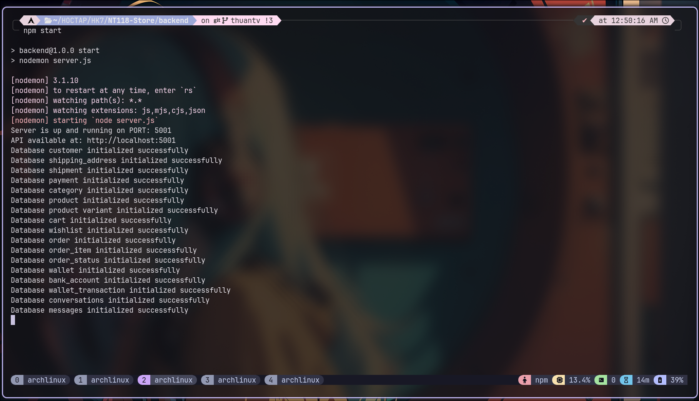
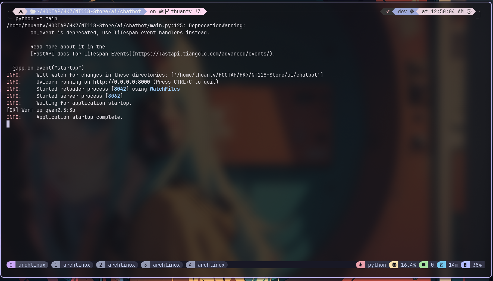
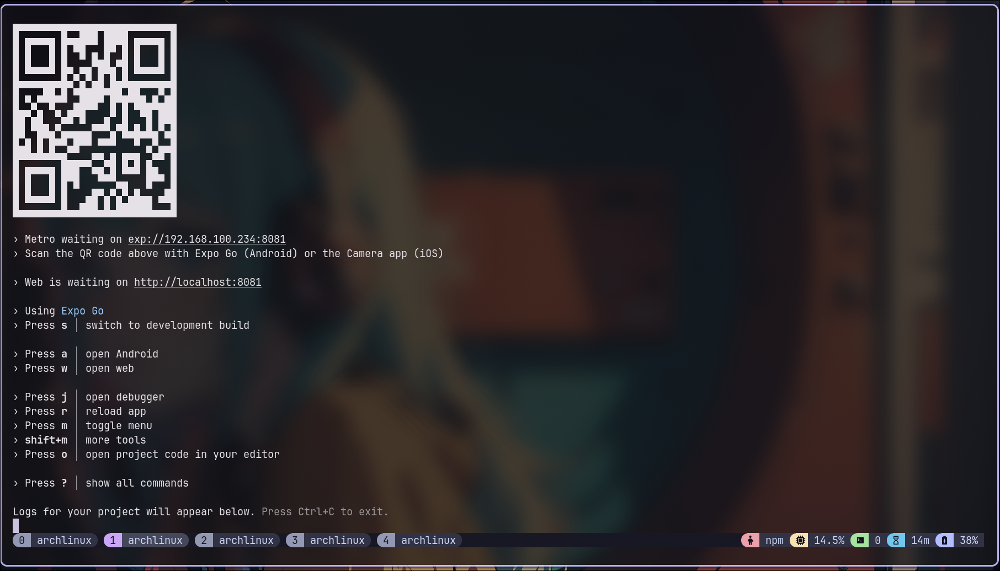

# NT118-Store

## 📱 E-Commerce Mobile Application
A modern multi-role e-commerce mobile application supporting buyers, sellers, and delivery drivers.

## 🚀 Running the Application

### Backend (Node.js + Express)


### AI Chatbot (Python)


### Mobile (Expo React Native)


## ✨ Key Feature

### 🤖 AI Shopping Assistant
- 💬 Chat with local AI (powered by Ollama) – intelligent shopping recommendations
- 🎯 Context-aware assistance based on orders and cart contents
- ⚡ Draggable floating chat bubble

### 👤 Buyer Role
- 🏠 Home screen with banner carousel & flash sale section
- 🔍 Product search and filtering by category
- 🛒 Shopping cart with product variants (size, color)
- ❤️ Wishlist management
- 📦 Real-time order tracking
- 💰 E-wallet and transaction history
- 💬 Direct chat with sellers

### 🏪 Seller Role
- 📊 Revenue dashboard and analytics
- ➕ Create products with multiple variants & images
- ✏️ Product management and editing
- 📦 Order management
- 💬 Chat with customers
- 🎨 Modern pink-themed interface

### 🚚 Shipper Role
- 📋 List of orders awaiting delivery
- 📍 Real-time location updates and order status changes
- ✅ Confirm successful delivery

## 🛠️ Tech Stack

### Frontend (Mobile)
- **Framework**: React Native + Expo Router
- **UI**: React Native components, Expo Linear Gradient
- **Auth**: Clerk Authentication
- **State**: React Hooks
- **API**: Fetch API, Socket.io client
- **Icons**: Ionicons, Vector Icons

### Backend
- **Runtime**: Node.js + Express
- **Database**: PostgreSQL (Neon)
- **Cache**: Redis (Upstash)
- **Image**: Cloudinary
- **AI**: Ollama
- **Real-time**: Socket.io

## 📚 Setup Guide

### 1. Clone Repository
```bash
git clone https://github.com/thuantv-uit/NT118-Store.git
cd NT118-Store
```

### 2. Backend Setup
```bash
cd backend
npm install
```

Create file `.env` in `backend/` folder:
```env
PORT=5001
DATABASE_URL=your_postgres_url
UPSTASH_REDIS_REST_URL=your_redis_url
UPSTASH_REDIS_REST_TOKEN=your_redis_token
API_URL=http://localhost:5001
CLOUDINARY_CLOUD_NAME=your_cloudinary_name
CLOUDINARY_API_KEY=your_cloudinary_key
CLOUDINARY_API_SECRET=your_cloudinary_secret
```

Run the backend:
```bash
npm start
```

### 3. Mobile Setup
```bash
cd mobile
npm install
```

Create a file `.env` in the `mobile/` folder:
```env
EXPO_PUBLIC_API_URL=http://your-ip:5001/api
EXPO_PUBLIC_CLERK_PUBLISHABLE_KEY=your_clerk_key
```

Run the app:
```bash
npm start
```

### 4. AI Assistant Setup

Install Ollama and pull model
```bash
ollama pull llama3.2
```

Setup the Python environment
```bash
cd ai/chatbot
conda create -n nt118-ai python=3.11 -y
conda activate nt118-ai
pip install -r requirements.txt
```

Generate embeddings and build the vector database
```bash
python -m vector
```

Run the local AI chatbot
```bash
python -m main
```

## 🔄 Git Workflow

### Pull lastest changes before coding
```bash
git pull origin main
```

### Create a new feature branch
```bash
git checkout -b feature/your-feature-name
```

### Commit and push
```bash
git add .
git commit -m "feat: add your feature"
git push origin feature/your-feature-name
```

### Create a Pull Request
- Open a PR on GitHub
- Request code review
- Merge into main after approval

### Sync after merge
```bash
git checkout main
git pull origin main
```

## 📁 Project Structure

```
NT118-Store/
├── backend/
│   ├── controllers/        # API controllers
│   ├── routes/             # API routes
│   ├── services/           # Business logic
│   ├── config/             # Config files
│   └── server.js
│
├── mobile/
│   ├── app/
│   │   ├── (auth)/         # Authencation screens
│   │   ├── (home)/         # Home Screens
│   │   ├── (buyer)/        # Buyer screens
│   │   ├── (seller)/       # Seller screens
│   │   ├── (shipper)/      # Shipper screens
│   │   ├── (chat)/         # Chat screens (Buyer ↔ Seller / AI)
│   │   └── (profile)/      # Profile screens
│   ├── components/         # Shared components
│   ├── constants/          # Constants & API config
│   └── assets/             # Images & fonts
│
├── ai/
│   └── chatbot/
│       ├── chroma_langchain_db/  # Chroma vector database
│       ├── features.csv          # Product features data
│       ├── vector.py             # Embedding generation script
│       ├── main.py               # AI Chatbot entry point
│       ├── requirements.txt      # Python dependencies
│       └── .env                  # API keys
│
├── start-dev.ps1                 # Quick start script
└── README.md
```

## 👥 Development Team
- **Hồ Thị Huỳnh My - 22520897**
- **Trần Thu Ngân - 22520937** 
- **Trần Văn Thuận - 22521448**

## 📄 License
MIT License - UIT NT118 Course Project
